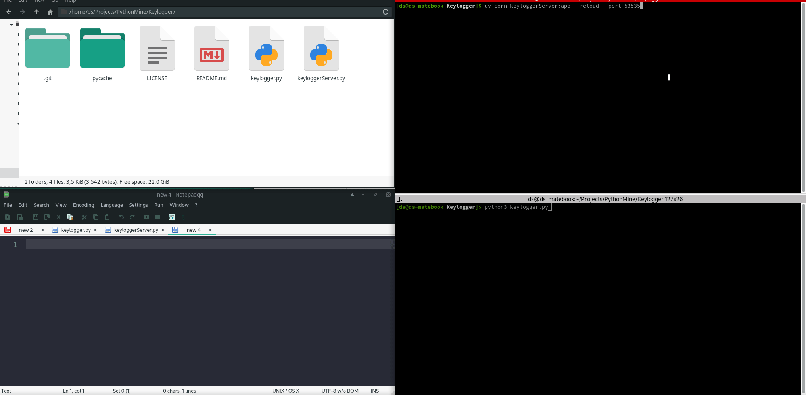

# Keylogger

## Description:
### Keylogger Python program that can also send log file to your machine via API post requests.
### Functionalities | How to run
1. Install prerequisites "pip install -r requirements.txt"
2. Can either be run standalone or log_sending can be set to True inside client keylogger.py file (victim machine)
3. Identifies operating system (supports windows, linux) and saves log file to temp folder (can be changed)
4. If you want to set it up for sending log files to your machine then make sure to edit the log sending variables. (server_address, server_port, sending_schedule_in_seconds, lines_difference (used for sending only when x number of new lines were added to the log file[victim user had activity].))
5. Start API Server on receiving end (your attacker machine) with following command "uvicorn keyloggerServer:app --reload --port 53535"
6. Notes: --reload is for debugging purposes in FastAPI, and set up the port as you wish.

### Demo Gif

